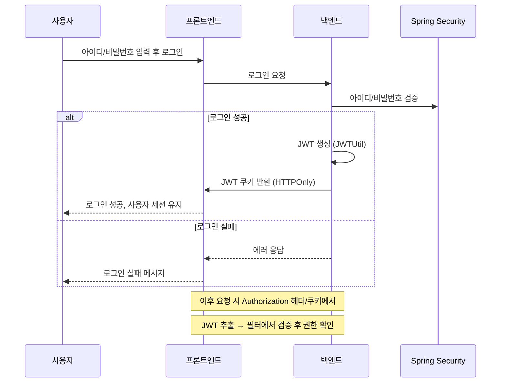
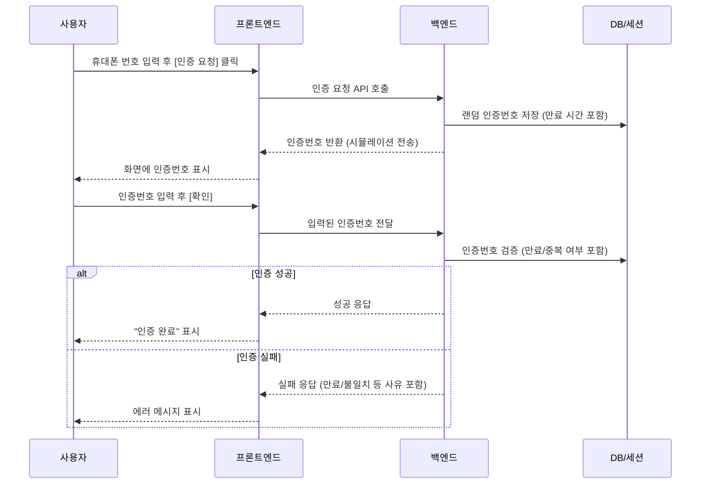

팀 프로젝트 - CAKE QUAKE(API 서버 부분)
---
* 프로젝트 기간: 2025년 05월 08일 ~ 2025년 07월 10일
* 개발 인원: 총 5명(전원 풀스택 개발)
    * 내 역할: 로그인, 회원 가입, JWT기능
* 프로젝트 설명: AI를 활용한 레터링케이크 예약 및 발주 시스템
    * Spring Boot 기반 REST API 설계 및 구현

---
### 개발 환경

* **운영체제**: Windows11
* **개발 언어**: Java
* **Backend**: Spring Boot, Spring Security, Spring Data JPA, SpringAi, OpenAi, JWT
* **개발 도구**: IntelliJ IDEA, Gradle, Dbeaver, JUnit 5
* **Database**: PostgreSQL
* **라이브러리**: Lombok

---
### 주요 구현 기능

* 시스템 주요 기능 요약
    * AI 기반 디자인 추천, 통합 예약 시스템, 온도 지수,  발주 시스템,
      JWT 기반 인증 및 권한 분리 로그인 시스템 (Spring Security 적용), 카카오톡 소셜 로그인 기능

* 맡은 기능들

#### 1. 로그인 및 JWT 인증

- CustomSecurityConfig에 커스텀 필터 추가 → 아이디/비밀번호 인증 전에 JWT 검증
- 필터에서 `Authorization 헤더` 또는 `쿠키`에서 토큰 추출
  → JWT 검증 성공 시 `Authentication` 객체 생성 후 Spring Security 컨텍스트에 저장
- 로그인 성공 시 `JWTUtil`로 토큰 발급 → `CookieUtil`로 HTTPOnly 쿠키에 저장
- 프론트는 토큰 정보를 활용해 로그인 사용자 식별 및 권한 처리

####	2. 카카오 소셜 로그인
- 기존 유저 → 바로 토큰 발급 & 로그인 완료
- 신규 유저 → 소셜 회원가입 페이지로 이동

####	3. 회원 가입
- 휴대폰 인증 시뮬레이션 구현
    - 인증번호 생성, 만료 시간 설정, 재전송 제한 등 **보안 요소 적용**
    - 인증 목적(`SIGNUP`, `RESET`, `CHANGE`)에 따라 로직 분기
    - 만료/중복 인증/잘못된 번호 입력 등 **세분화된 예외 처리**
    - 인증 내역을 DB에 저장하여 추후 **실제 문자 API 연동 시 확장 가능**

- 휴대폰 인증 흐름

- 국세청_사업자등록정보 진위확인 및 상태조회 API 서비스
    - 판매자 회원가입 시 실제 사업자인지를 검증하기 위해 공공데이터 포털의 국세청 사업자등록정보 진위확인 및 상태조회 API를 연동

####	4. 매장 승인 관리 기능
- **검색 & 상태 필터링 구현**  
  - 판매자의 ID, 이름, 매장명 기준으로 검색 가능  
  - 상태(PENDING, APPROVED, REJECTED 등)에 따른 필터링 지원  

- **QueryDSL 활용**  
  - `BooleanBuilder`로 동적 검색 조건 구성  
  - `JPQLQuery`로 조건에 맞는 매장 신청 목록 조회  

- **확장성 고려**  
  - 검색 조건이 추가되더라도 `BooleanBuilder`를 통해 손쉽게 확장 가능  
  - 관리자 페이지에서 매장 상태 관리 및 검토 프로세스에 활용
  
   
---
**후기**: 스프링부트를 API 서버 전용으로 사용하는 것은 부트캠프에서 처음 경험한 방식이었습니다. 
화면 없이 테스트를 진행해야 해서 다소 어려움도 있었지만, 프로젝트를 만들면서 RESTful API 설계와 검증 과정을 직접 경험할 수 있었고, REST에 한층 더 익숙해지는 계기가 되었습니다.